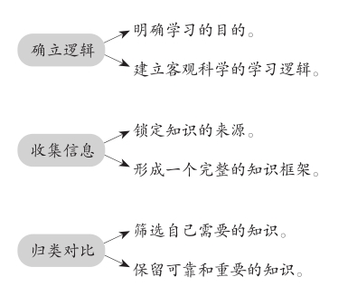

## 费曼学习法

## 简介

`高付出` 的学习中，我们有时得到的却是 `低效能` ；不具备输出(应用)这些知识的能力。

费曼学习法是一种顶级的思维方式，它能帮助我们真正掌握一门知识，揭示了学习和思考的本质。

## 核心要素

1. `concept`  确立要学习的目标。列出自己想要了解的知识点。
2. `concept` 理解你要学习的对象。准备和筛选相关的资料。
3. `teach` 以教代学，用输出代替输入。
4. `review` 回顾和反思。
5. `simplify` 实现知识的简化和吸收。

---

目的地主动学习，在小组讨论的基础上不断地接触新信息，总结分析，消化吸收，再做出选择

## 思维模式

1. 好的思维模式需要正反馈。
2. 输出加快思考的成熟。
3. 思考可以量化。

## 主要步骤

### 确立一个学习目标

学习不再是 `被动服从` 和由 `功利驱动` 的 "输入"，而是我们自觉甚至是开心地实施有意识的 `主动学习`，也就是以 "输出" 为载体的 "有选择的输入"。

#### 追求四个方面进步

目标明确的学习可以极大地改变一个人的思维，对于训练和改进 我们的思维方式而言，这是一个必不可少的基础。

好处：	

1. 开放性思维

2. 批判性思维
3. 逻辑性思维
4. 清晰凝练的表达力

---

### 聚焦目标

抓住学习的黄金时间，将全部的精力聚焦于选定的目标 之上，心无旁骛地把这门知识/技能学通、学精和化为己用

好处：

1. 思维更加清晰。
2. 行动更有针对性。

​	

#### 如何寻找正确方向

1. 对自己提出关键问题
2. 把 `最重要的那件事` 变成自己的方向

#### 如何找到真正的兴趣

深入分析那些自己喜欢的领域，查阅相关的资料，然后进行初步的尝试，从中找到自己学习的对象。

---

### 和目标建立 "强联系"

1. 论证学习这门知识/做这件事的必要性
2. 确认规划与目标的实质联系

学习的舒适区两个标准：

1. 符合自身的兴趣。
2. 在自己能力范围内的合理目标。符合自身能力。

---

### 规划一条高效学习之路

1. 留出锁定最重要的目标时间
2. 留出做正确规划的时间
3. 留出调整目标和规划的时间

---

### 目标原则

1. 全面性原则：制定目标时要有全局和整体观念。
2. 重点性原则：制定目标要有侧重点、针对性。
3. 挑战性原则：制定的目标要能挖掘和激发自己的潜能。
4. 可行性原则：制定的目标要切实可行。
5. 可调性原则：制定的目标要具有一定的可调性，随着环境和内外条 件的变化，我们能对学习的目标进行必要的调整，适应变化。在实施过程中留有余地。

---

### 理解学习的知识

我们要学习的知识和概念进行归类对比，系统地理解这些内 容，建立筛选和学习的原则。

#### 归类和对比知识的来源

##### 如何将知识有逻辑地系统化

1. 明白自己学习的是什么。
2. 拥有一个足够宽阔的视野。
3. 建立最可能客观科学的逻辑。

##### 筛选和留下最可靠的知识

###### 筛选知识方法论

1. 清晰知道自己的短板。
2. 重点学习哪方面的内容。

###### 保留可靠的知识

1. 找出那些符合实际需求相匹配的知识。
2. 屏蔽来源不可靠的知识。
3. 小心对待差异化的知识。
4. 用对比的方式挑选和分辨知识。

---

